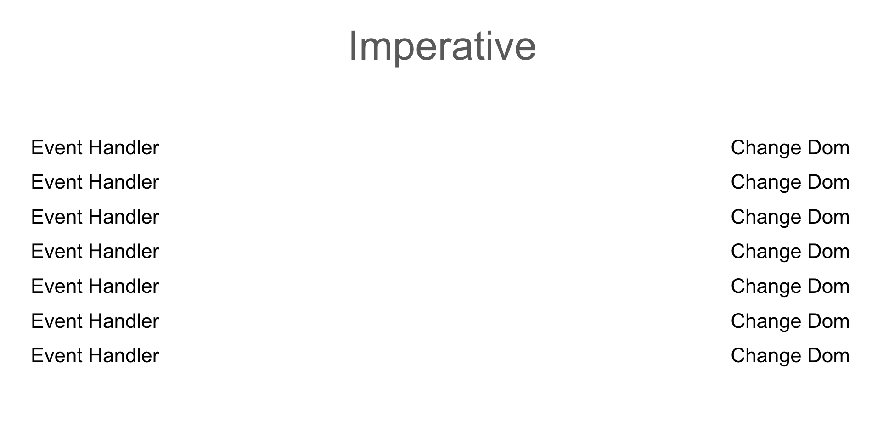
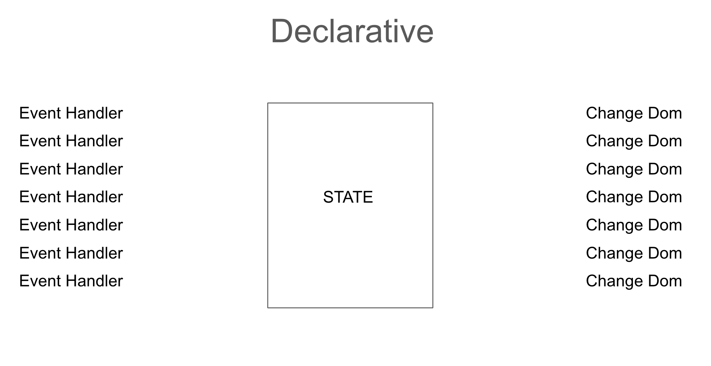
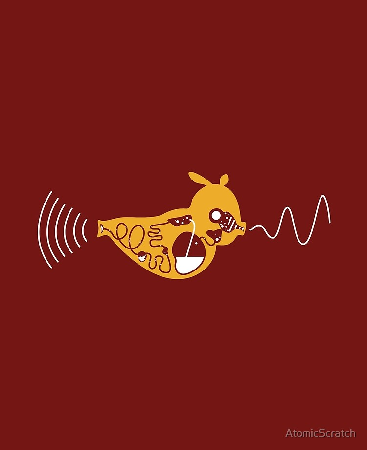
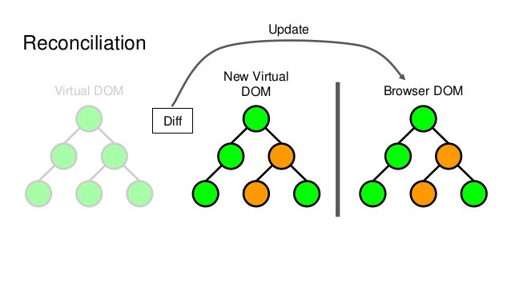

---
# try also 'default' to start simple
theme: seriph
# random image from a curated Unsplash collection by Anthony
# like them? see https://unsplash.com/collections/94734566/slidev
background: https://source.unsplash.com/collection/94734566/1920x1080
# apply any windi css classes to the current slide
class: 'text-center'
# https://sli.dev/custom/highlighters.html
highlighter: shiki
# show line numbers in code blocks
lineNumbers: false
# some information about the slides, markdown enabled
info: |
  ## Slidev Starter Template
  Presentation slides for developers.

  Learn more at [Sli.dev](https://sli.dev)
# persist drawings in exports and build
drawings:
  persist: false
# use UnoCSS
css: unocss
---

# KODEMIA: REACT

---

# React (sesión 1): Introducción, instalación y primer componente

Fecha: 19/12/2022

- Programación declarativa e imperativa
- SPA
- Babel y Webpack
- React
- Componentes
- JSX, qué es y para qué sirve
- Creación de proyectos (create-react-app)
- Componente principal y cómo se renderiza
- Primer componente funcional


---

# Programación imperativa vs programación declarativa


- Programación imperativa: HOW

Manipulamos el DOM paso a paso, desde la creación de un selector, definir un evento, identificar el valor o la variable y finalmente manipular el DOM


- Programación declarative: WHAT

Modificamos el estado y éste se encarga de actualizar el DOM

---

<div class="container mx-auto">
  
  
  <arrow v-click="1" x1="240" y1="190" x2="740" y2="315" color="black" 		width="1" arrowSize="1" />
  <arrow v-click="2" x1="240" y1="350" x2="740" y2="220" color="black" 		width="1" arrowSize="1" />
  <arrow v-click="3" x1="240" y1="380" x2="740" y2="345" color="black" 		width="1" arrowSize="1" />
  <arrow v-click="4" x1="240" y1="285" x2="740" y2="375" color="black" 		width="1" arrowSize="1" />
  <arrow v-click="5" x1="240" y1="315" x2="740" y2="260" color="black" 		width="1" arrowSize="1" />
  <arrow v-click="6" x1="240" y1="220" x2="740" y2="285" color="black" 		width="1" arrowSize="1" />
  <arrow v-click="7" x1="240" y1="250" x2="740" y2="190" color="black" 		width="1" arrowSize="1" />


</div>


---


<div class="container mx-auto">
   
</div>


---

# SPA o Single Page Application

<div>

  <ul>
    <li>Inspiradas en el comportamiento de aplicaciones móviles</li>
    <li>Un sólo documento HTML</li>
    <li>Pueden haber múltiples rutas</li>
    <li><a href="https://www.airbnb.mx/" target="_blank">Ejemplo</a></li>
  </ul>
  
</div>

---

# REACT

<div class="flex">

  <div class="w-1\/2 flex ml-10 mt-10 flex-col">
    <ul>
      <li>Librería creada por facebook (Meta) en 2013</li>
      <li>Open Source</li>
      <li>Objetivo: construir interfaces
      </li>
      <li>Current version: React 18</li>
      <li>Antes de React 16.8 los componentes sólo podían ser clases</li>
      <li>Declarativa y basada en componentes</li>
      <li><a href="https://2021.stateofjs.com/en-US/">The State of JS</a></li>
    </ul>
  </div>

  <div class="w-1\/2">

  

  </div>

</div>


---

# Componentes

<div class="flex">

  <div class="w-1\/2">

  

</div>

  <div class="w-1\/2 flex ml-10 mt-10 flex-col">
    <ul>
      <li>Unidades aisladas</li>
      <li>Conjunto de lógica, representación y diseño</li>
      <li>Reutilizables</li>
      <li>Modelo mental para construir aplicaciones</li>
      <li>Ejemplo (freelancer)</li>
    </ul>
  </div>

</div>


---

## Babel and Webpack

<div class="flex">

<div class="w-1\/2">

  

</div>

<div class="w-1\/2 flex ml-10 mt-10 flex-col">
  <ul>
    <li>Babel es un transcompilador: convierte código de ES6 en versiones compatibles con el navegador. También convierte jsx y Typescript</li>
    <li>Webpack es un "module bundler". Genera los paquetes de código necesarios para llevar a producción un proyecto frontend.</li>

  </ul>
  </div>
</div>


---

# JSX

¿Qué es y para qué sirve?

"Es una extensión de la sintaxis de JavaScript. JSX produce 'elementos' de React."

Lo que está dentro de los corchetes será evaluado como código de JavaScript.

```jsx{all|3|all}

function Welcome(props) {
  return <h1>Hello, {props.name}</h1>;
}


```

---

# Create React App
```
https://create-react-app.dev/

```

---


# TAREA

- Dev.to nav / header
- 1 repositorio por equipo
- Empezar a elaborar el read.me con información relevante sobre su equipo

---


# React (sesión 2): Estado, Props y Hooks

Fecha: 20/12/2022


- ¿Qué es el Estado?
- ¿Qué son las props?
- ¿Qué es el DOM virtual?
- ¿Que es la reconciliación?
- ¿Qué es el algoritmo de diffing?
- ¿Qué son las props?
- Hook useState


---

## Estado y props tienen información sobre nuestro componente. Pero el estado se administra dentro del mismo mientras que las props son información que se pasa de un componente padre a un componente hijo.

---

# ¿Cómo funciona React?

## React utiliza un DOM virtual. El DOM virtual es una representación del DOM. Es la herramienta declarativa que nos ofrece la librería para manipular el DOM

<div class="flex">
	
</div>


---

## Reconciliación es la relación entre el DOM y el DOM virtual, siendo éste último una copia de éste. Cuando hay modificaciones en el estado de un componente, se lleva a cabo un proceso de diffing, es decir, React compara el DOM y el DOM virtual, encuentra las diferencias, y re-renderiza únicamente los nodos cuyo estado fue modificado y sus descendientes

---
